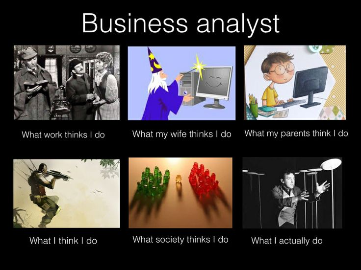
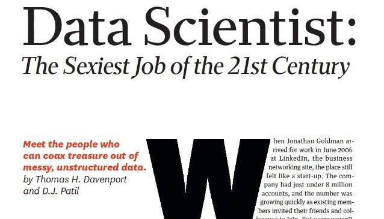
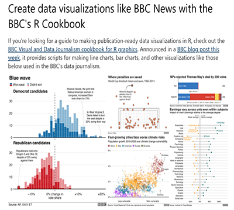
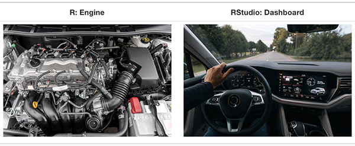
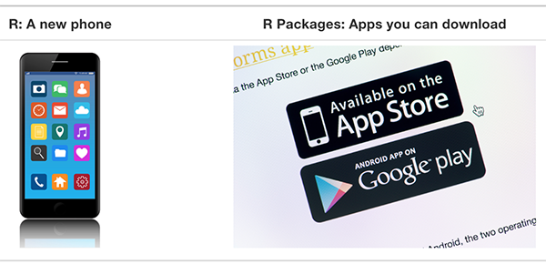
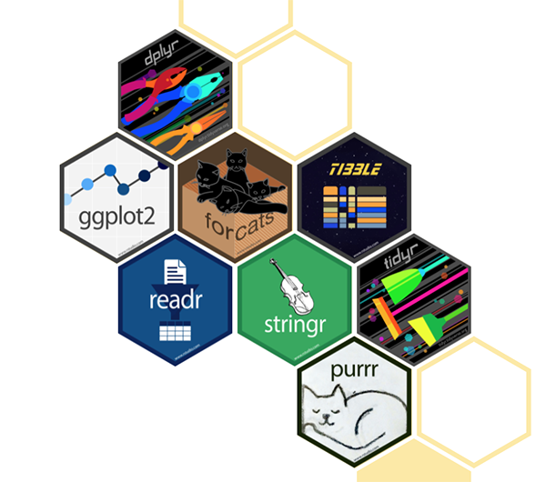

```{r setup, include=FALSE}
options(htmltools.dir.version = FALSE)
knitr::opts_chunk$set(echo = TRUE,   
                      message = FALSE,
                      warning = FALSE,
                      fig.height = 4,
                      fig.width = 8,
                      fig.align = "center")
```
# Hello



---
# Let's get excited

[It's not all about money, but](https://www.payscale.com/research/AU/Job=Business_Analyst%2C_IT/Salary)

[More money](https://au.indeed.com/career/business-analyst/salaries/Melbourne-VIC)

Current market: [seek.com.au](https://www.seek.com.au/business-analyst-r-jobs)

Current skills demand: [we are getting there!](https://www.r-bloggers.com/2021/04/7-must-have-skills-to-get-a-job-as-a-data-scientist/)



---
# So let' dig into what we need for those jobs!

## Unit topics:

- Data storytelling

- Visualization 

- Data wrangling skills

- Data modelling - this is how you get data insights!

- Lots of practical cases and real life data -> build your portfolio **NOW**

---
# So let' dig into what we need for those jobs!

## Practical skills:

- R and RStudio: Yes, they do pay **MORE** (tsss... **MUCH** more) to those who "code" data

- Git/Github: collaborative environment to put your data insights (and portfolio for [job search](https://www.seek.com.au/r-business-analyst-jobs))

- Math and stats required for [business analysts jobs](https://targetjobs.co.uk/careers-advice/job-descriptions/454089-data-analyst-job-description)
---
# Assessment

- **Take home tests**: 3 practical exercises (5%+10%+10%=25%), sessions 4, 6, 8

- *Data Analytics Project**: a [Kaggle](https://www.kaggle.com/) style project data wrangling, modelling and visualisation. 
Very practical! (35%), session 10

- **Business report & presentation**: story telling based on data analysis, groups of 2. Practical + research (25% + 15% =40%), session 14

---
# Hints:  

- Form your groups early (**today!**), so you can start working on your project

- Make sure you set up your group at VU Collaborate -> Communication -> Groups

- Exchange your details, including non-VU emails and phone numbers.

- Great idea to use WhatsApp and Zoom!

- As well as set up common space to store your files: e.g. OneDrive / Dropbox
---
# Textbook

- Wickham, H., & Grolemund, G. (2017). **R for data science**: import, tidy, transform, visualize, and model data (First edition.). O’Reilly Media.
Available at [here](https://r4ds.had.co.nz/)

- Yihui Xie, J. J. Allaire, Garrett Grolemund (2020). **R Markdown**: The Definitive. Guide.
Available [here](https://bookdown.org/yihui/rmarkdown/)

- Wickham, H. (2009).  **ggplot2**: Elegant Graphics for Data Analysis
Available [here](https://ggplot2-book.org/)
---
# Expectations

- Turn up to class and **TURN ON YOUR CAMERA**, summarise your notes after each, note what you understand, and what you don't

- Do exercises from the textbook related to material each week, check your answers with solution (**after class activities**)

- Participate actively in practical exercies, work with team mates to solve problems, get best answers 

---

#Coding?

**This is NOT a programming unit! We focus on data**

Why R:

- Free software environment 

- Widely used among statisticians and data analysts

- Easy to learn and use for data manipulation, statistical modeling, and graphics

- Used by many large companies: uUber, Google, Airbnb, Facebook and so on
---
# Plan for the session

- Basic concepts 

- Software setup: R/RStudio and Git/Github

- R and RMarkdown basics

---
# Business analytics

[Let's see](https://www.youtube.com/watch?v=lNjrAXGRda4)

[want to try yourself?](http://blog.rtwilson.com/john-snows-cholera-data-in-more-formats/)

[and now we have this...](https://www.google.com/search?q=covid+data&oq=COVID+data&aqs=chrome.0.0i20i131i263i433j0i20i263j0i131i433j0j0i131i433j0l5.2624j0j4&sourceid=chrome&ie=UTF-8)

---

# What is business analytics?

- **Business analytics** is the scientific process of learning from data, transforming data into insight for making better decisions

- *Broader* than **business intelligence** which focuses on describing and predicting performance.

- *Broader* than **econometrics/statistics** which typically starts from theory (hypotheses or models), and analysts assess if the data supports or refutes.

- *Narrower* than **data science** as we are primarily focusing on *business problems*
---

# Data visualization in R

[How the BBC Visual and Data Journalism team works with graphics in R](https://medium.com/bbc-visual-and-data-journalism/how-the-bbc-visual-and-data-journalism-team-works-with-graphics-in-r-ed0b35693535)
[BBC cookbook for journalists](https://bbc.github.io/rcookbook/)


---
# So what?

## The biggest question in business analytics is ‘Why?’ 

- Why is this happening? If you notice that there’s a pattern, ask, **“Why?”** 

- Is there something wrong with the data or is this an actual pattern going on? 

- **[Business analysts** are] able to think of ways to use data to solve problems that otherwise would have been unsolved, or solved using only intuition.*-- Peter Skomoroch, Former Principal Data Scientist at Link*

---
# Software set up

- [R/RStudio](https://www.rstudio.com/products/rstudio/download/)
  
  **Step 1**. Set up R
  
  **Step 2**. Set up RStudio
  
  [Video](https://www.youtube.com/watch?v=PrTOjW6tc2M&feature=youtu.be)

- Git/Github 

  **Step 1**. Create a Github account and add academic benefits
  
  ** you can use your personal email, but please make sure that you add your **VU one** as a secondary one (as I show on the video!)
  
  **Step 2**. Connect RStudio to Git/Github
  
  [Video](https://www.youtube.com/watch?v=PrTOjW6tc2M&feature=youtu.be)
  
---

# What are R and RStudio?



---
# What should I click on to start?


---

# R and RMarkdown basics

Let's practice

- First let's have a look at the interface


---
# Which file to start with?

We will be working with two types of files: 

- [R Script]() and 

- [RMarkdown]()

---
# What are R packages?

R packages add additional functions, data, and documentation to the "naked R"



---
# How to use them?

Some packages are "must haves": [`tidyverse`](https://www.tidyverse.org/)

Others - "oh I need to do this, which package can [help](https://cran.r-project.org/)?"

 


---
# Some good practices in R

- Read the message in the console and don't get scared if it is in RED. `warnings` are not `errors`

- Use `comments` very often! it will be much easier to "get back" to your code

- Use white space to separate your code lines where you need: it will look more "readable" for YOU

- Ask for help!

---

# Cheatsheets are GREAT!

[Cheatsheets](https://www.rstudio.com/resources/cheatsheets/), you can also find the relevant ones under Resources for the unit!

[](img/R5.png)
---

# Where to ask for help?

- ME! maria.prokofieva@vu.edu.au

- [stackoverflow](https://stackoverflow.com/questions/tagged/r)

- [R community on Twitter](https://twitter.com/search?q=rstats&src=typed_query)


