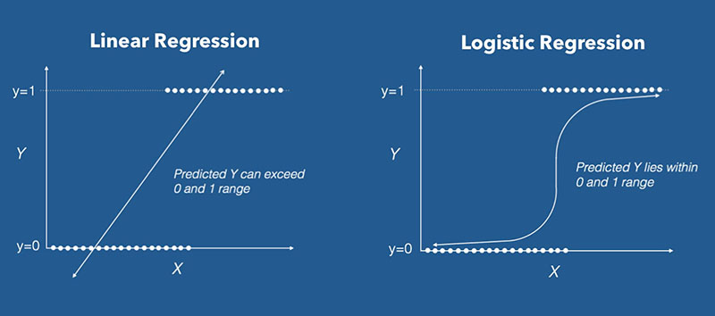
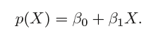
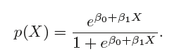

```{r setup, include=FALSE}
knitr::opts_chunk$set(echo = TRUE)

#install.packages("broom")
library(tidyverse)
library(scales)
library(broom)
library(janitor)
theme_set(theme_light())
```
# Plan for today

- Classification in modelling

- Classification vs regression

- Logistic regression 

- Model assessment in classification vs regression
---
#Classification

-a predictive modeling problem where te outcome variable is a category (=**class**) 

The **input** variables can  be either continuous or categorical or a mix, but the 
**output** variable should be a category

*Examples*: 
Given an example, classify if an email is spam or not. 
Given a handwritten character, classify it as one of the known characters.

The model that allows to "classify" an object based on other variables is called a **classifier**.

---
#Classification

**What is the probability of the category?**

the methods that are often used for *classification* first predict the *probability* of each of the categories of a qualitative variable, as the basis for making the classification.

Example: boy or girl?

Gender falls into one of the two categories: male or female

*Question*: can we predict gender based on hair length? (longhair-> female, !longhair->male)

How can we write this down in math terms? **Pr(gender=female|longhair)** 
Pr is *probability*

and probability = longhaired female / all people

so P will range between 0 and 1

So we use `maximum likelihood` estimation and use `logistic regression` (0 vs 1)
---

# Logistic regression

- a statistical model that in its basic form uses a logistic function to model a binary dependent variable

- binary dependent variable by default but this is fixable!

- logistic regression (or logit regression) is estimating the parameters of a logistic model (a form of binary regression).

 

---
# Logistic regression

Logistic regression belongs to a family, named **Generalized Linear Model (GLM)** = developed for extending the linear regression model 

Also called: 

- binary logistic regression, binomial logistic regression and logit model.

But!!!! can take more than 2 distinct outcome variables!

---
#Logistic regression

 

 

But the part that we are interested in is:

log[p/(1-p)] = b0 + b1*x1 + b2*x2 + ... + bn*xn

log[p/(1-p)] is called the logarithm of the odd, also known as log-odd or logit.

The odds reflect the likelihood that the event will occur = It can be seen as the ratio of “successes” to “non-successes”. 

In simple language:

odds = probability of an event / probability that the event will not take place 

Example: 

If the probability of being diabetes-positive is 0.5, the probability of “won’t be” is 1-0.5 = 0.5, and the odds are 1.0.
---
#Steps to take:

- clean the data `tidyverse`

- transform the data `tidyverse`

- split the data into training and testing datasets

- model the data `tidyverse` + `glm()`

- evaluate the model

- repeat til you are happy with the model!
---
#Training and testing datasets

*Training set* is the one on which we train and fit our model basically to fit the parameters whereas *testing data* is used only to assess performance of model. 

The goal is to produce a *trained (fitted) model* that generalizes well to new, *unknown* data. 

The fitted model is evaluated using “new” examples from the held-out datasets (validation and test datasets) to estimate the model's accuracy in classifying new data.

 
---
#Computing logistic regression

- use the R function `glm()`, for *generalized linear model*.

- specify the option family = binomial, which tells to R that we want to fit logistic regression.

```{r eval=FALSE}
# Fit the model
model <- glm( outcome ~., data = train_data, family = binomial)

# Summarize the model
summary(model)

# Make predictions
probabilities <- model %>% predict(test.data, type = "response")
predicted.classes <- ifelse(probabilities > 0.5, "pos", "neg")

# Model accuracy
mean(predicted.classes == test.data$outcome)
```
---
#Basic components of `glm()`:

---
#Dataset

```{r}
#install.packages("mlbench")
#install.packages("caret")
library(mlbench)
library(caret)
```

Review the documentation for the library at CRAN.

Read about the dataset `PimaIndiansDiabetes2`

---

```{r}
# Load the data and remove NAs
data(PimaIndiansDiabetes2)
PimaIndiansDiabetes2 <- na.omit(PimaIndiansDiabetes2)

# Split the data into training and test set
training.samples <- PimaIndiansDiabetes2$diabetes %>% 
  createDataPartition(p = 0.8, list = FALSE)

train_data  <- PimaIndiansDiabetes2[training.samples, ]
test_data <- PimaIndiansDiabetes2[-training.samples, ]
```
---
Builds a model to predict the probability of being diabetes-positive based on the plasma glucose concentration:

```{r}
model <- glm( diabetes ~ glucose, data = train_data, family = binomial)
summary(model)$coef
#or
tidy(model)
```
---
```{r}
tidy(model)
```
The intercept (b0) is -6.32 and the coefficient of glucose variable is 0.043.

The logistic equation can be written as
p = exp(-6.32 + 0.043* glucose)/ [1 + exp(-6.32 + 0.043* glucose)]. 

Using this formula, for each new glucose plasma concentration value, you can predict the probability of the individuals in being diabetes positive.

---
Predictions can be easily made using the function `predict()`. Use the option type = “response” to directly obtain the probabilities

```{r}
probabilities <- model %>% predict(test_data, type = "response")
predicted.classes <- ifelse(probabilities > 0.5, "pos", "neg")
predicted.classes
```
---
To visualise:
```{r}
train_data %>%
  mutate(prob = ifelse(diabetes == "pos", 1, 0)) %>%
  ggplot(aes(glucose, prob)) +
  geom_point(alpha = 0.2) +
  geom_smooth(method = "glm", method.args = list(family = "binomial")) +
  labs(
    title = "Logistic Regression Model", 
    x = "Plasma Glucose Concentration",
    y = "Probability of being diabete-pos"
    )
```
---
#Multiple logistic regression

The multiple logistic regression is used to predict the probability of class membership based on multiple predictor variables, as follow:

```{r}
model <- glm( diabetes ~ glucose + mass + pregnant, 
                data = train_data, family = binomial)
tidy(model)
```
---
Here, we want to include all the predictor variables available in the data set. This is done using ~.:
```{r}
model <- glm( diabetes ~., data = train_data, family = binomial)
tidy(model)

```
---
#Interpretation


*Estimate*: the intercept (b0) and the beta coefficient estimates associated to each predictor variable

*Std.Error*: the standard error of the coefficient estimates. This represents the accuracy of the coefficients. The larger the standard error, the less confident we are about the estimate.

*z value*: the z-statistic, which is the coefficient estimate (column 2) divided by the standard error of the estimate (column 3)

*Pr(>|z|): The p-value* corresponding to the z-statistic. The smaller the p-value, the more significant the estimate is.

Note that, the functions coef() and summary() can be used to extract only the coefficients, as follow:

```{r}
coef(model)
summary(model )$coef
#or
tidy(model)
augment(model)
```
---
#Interpretation

- only 5 out of the 8 predictors are significantly associated to the outcome. 
These include: *pregnant, glucose, pressure, mass and pedigree*.

The coefficient estimate of the variable glucose is b = 0.045, which is positive. 
This means that an increase in glucose is associated with increase in the probability of being diabetes-positive. 

The coefficient for the variable pressure is b = -0.007, which is negative. This means that an increase in blood pressure will be associated with a decreased probability of being diabetes-positive.

**Important** logistic beta coefficient is the odds ratio. 

An odds ratio measures the association between a predictor variable (x) and the outcome variable (y). 

It represents the ratio of the odds that an event will occur (event = 1) given the presence of the predictor x (x = 1), compared to the odds of the event occurring in the absence of that predictor (x = 0).

For a given predictor (say x1), the associated beta coefficient (b1) in the logistic regression function corresponds to the log of the odds ratio for that predictor.

If the odds ratio is 2, then the odds that the event occurs (event = 1) are two times higher when the predictor x is present (x = 1) versus x is absent (x = 0).

For example, the regression coefficient for glucose is 0.042. This indicate that one unit increase in the glucose concentration will increase the odds of being diabetes-positive by exp(0.042) 1.04 times.

From the logistic regression results, it can be noticed that some variables - triceps, insulin and age - are not statistically significant = they should be eliminated. 

Select manually the most significant:
```{r}
model <- glm( diabetes ~ pregnant + glucose + pressure + mass + pedigree, 
                data = train_data, family = binomial)
```
---
#Assessing model accuracy

The *model accuracy* is measured as the proportion of observations that have been correctly classified. 

The *classification error* is defined as the proportion of observations that have been misclassified.

Proportion of correctly classified observations:
```{r}
mean(predicted.classes == test_data$diabetes)
```

The classification prediction accuracy is about 76%, which is good. 

The misclassification error rate is 24%.

There are also several other metrics for evaluating the performance of a classification model 

