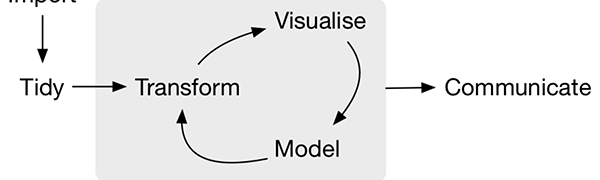
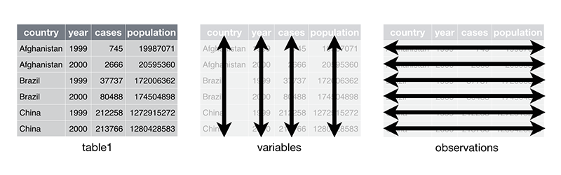

```{r setup, include=FALSE}
options(htmltools.dir.version = FALSE)
```

# Plan for today

- R refresher

- Tidy data concept and visualization

- Data and types of data

- Data issues:  “noisy data”, “missing data”

- Data wrangling

- Finish Git/Github setup

---
# Let's have a look at the data first

[TidyTuesday project](https://github.com/rfordatascience/tidytuesday)

[Dataset](https://github.com/rfordatascience/tidytuesday/blob/master/data/2020/2020-12-22/readme.md)

[csv file](https://github.com/rfordatascience/tidytuesday/blob/master/data/2020/2020-12-22/big-mac.csv)

We can load the dataset into our R using

```{r message=FALSE}
#don't forget that # is a comment

library(tidyverse) 

#let's create variable data and load our dataset

data<-read_csv('https://raw.githubusercontent.com/rfordatascience/tidytuesday/master/data/2020/2020-12-22/big-mac.csv')
```

---
```{r message=FALSE}
#look at first rows

data %>% head()

#let's have a look at one of the variables

head(data$currency_code)
```
---

```{r message=FALSE}
#let's store this variable in a separate variable

currency<-data$currency_code #note changes in the environment 

head(currency)

#assign a new value
currency<-"AWESOME"

#remove the new variable
rm(currency)

```

---

## All brilliant answers start with a question:

Look at the dataset and think about questions that you can come up with
---
# Data and Data wrangling

**Data wrangling** is the process of 

- gathering, 

- *selecting*, and 

- *transforming* data 

**to answer an analytical question**. 

= data cleaning 

= data “munging”

Business analysts spend 80% of their time on this, and *ONLY* 20% for exploration and modeling.
---
# Data analysis workflow



---
# Datasets 

Most statistical datasets are data frames made up of *rows* and *columns.* 

The columns are almost always *labeled* and the rows are sometimes labeled.

A **dataset** is a collection of **values**, e.g. numbers (if *quantitative*) or strings (if *qualitative*). 

**Values** are organised in two ways:

- Every value belongs to a *variable* and an *observation*.

A *variable* contains all values that measure the same underlying attribute (like height, temperature, duration) across units. 

An *observation* contains all values measured on the same unit (like a person, or a day, or a race) across attributes
---

# Tidy data concept

**Tidy data** is a standard way of *mapping* the meaning of a dataset to its structure. 

A dataset is *messy* or tidy depending on how rows, columns and tables are matched up with observations, variables and types. 

In tidy data:

- Every column is a variable.

- Every row is an observation.

- Every cell is a single value.


---
#Tidying messy datasets

Real datasets are messy

Five most common problems with messy datasets:

- Column headers are values, not variable names.

- Multiple variables are stored in one column.

- Variables are stored in both rows and columns.

- Multiple types of observational units are stored in the same table.

- A single observational unit is stored in multiple tables.

---

# Example: 

```{r}
messy_data<-relig_income

messy_data%>%head()
```
---

```{r}
relig_income %>% 
  pivot_longer(-religion, names_to = "income", values_to = "frequency")
```
---

# Data and types of data

Data comes in different forms and shapes

**Think about most common data formats you use?**

Data repositories:

- [Kaggle](https://www.kaggle.com/datasets)

- [data.gov.au](https://data.gov.au/)

- [TidyTuesday project](https://github.com/rfordatascience/tidytuesday)

- [Makeover Monday](https://www.makeovermonday.co.uk/data/)

---
# Visualization in the current world

A picture is worth a thousand words

It is all started with [this video](https://www.youtube.com/watch?v=hVimVzgtD6w)

*Can we have a look?*

Gapminder case study 

https://www.gapminder.org/tools/#$chart-type=bubbles

Another [example](https://bing.com/covid)

Get practice: [MakeOver Monday](https://www.makeovermonday.co.uk/)
and learn from [others](https://twitter.com/search?q=makeovermonday&src=typeahead_click)

---
# RMarkdown

*Markdown* (vs RMarkdown) is a way to create formatted text using a plain-text editor.

It is a VERY WELL established format in the industry and used VERY widely.

*R Markdown* is the next level that allows to combine markdown with R code.

This allows to combining your code, its results, and your text/graphics commentary. 

R Markdown files (.rmd vs .r for R scripts) can be used in three ways:

- For communicating to decision makers, who want to focus on the conclusions, not the code behind the analysis.

- For collaborating with other business analysts, who are interested in both your conclusions, and how you analysed your data (i.e. the code).

- As a notebook for yourself where you can record your code and your reflections.
---
# Practice

Let's create a RMarkdown document in R and study it

The document contains three important types of content:

- A meta information (YAML header) surrounded by ---s.

- Chunks of R code surrounded by ```.

-Text mixed with simple text formatting like # heading and _italics_.

---
# RMarkdown basics

Study the generated default .rmd file and identify relevant parts.

Do changes in the document using this [link as a guide](https://rmarkdown.rstudio.com/lesson-8.html)

---

# Resources

[Afterclass reading](https://r4ds.had.co.nz/r-markdown.html)
[Intro](https://rmarkdown.rstudio.com/lesson-1.html)

[Cheatsheet](https://www.rstudio.com/wp-content/uploads/2015/02/rmarkdown-cheatsheet.pdf)

[R Markdown: The Definitive Guide](https://bookdown.org/yihui/rmarkdown/)

---
# Finish Git/Github setup
