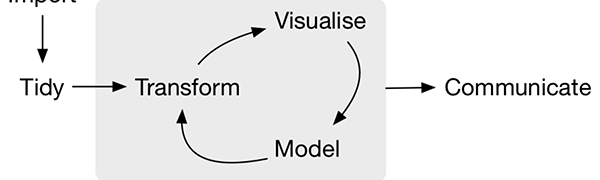
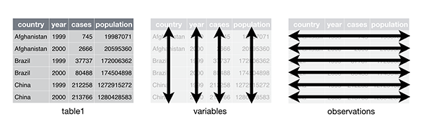

```{r setup, include=FALSE}
options(htmltools.dir.version = FALSE)
knitr::opts_chunk$set(echo = TRUE,   
                      message = FALSE,
                      warning = FALSE,
                      fig.height = 4,
                      fig.width = 8,
                      fig.align = "center")
library(tidyverse)
```
#Plan for today

- R/RMarkdown refressher

- Data wrangling

- `tidyverse`: Basic functions for data wrangling 

- Tidy format

- How to make you data tidy

### It is not a programming unit! We concentrate on **DATA**!!!

---

#R/RMarkdown refresher

- Use the project which we created in session 1

- create a new RMarkdown document

- locate 3 sections in Rmarkdown: meta data, text/graph/ R chunks

- remove the canned text/graphs and R chunks

- load the package `tidyverse` in the R chunks: How do we do it?

- load the data using the variable `mac_index`. Use the same data: `https://raw.githubusercontent.com/rfordatascience/tidytuesday/master/data/2020/2020-12-22/big-mac.csv`
How do we do it?

- write a sentence with the narration describing the dataset: where do we write this?

- in your narration use *italics* and **bold** fonts

- in the R chunks present the first 6 observations from the dataset: How do we do it?

- create a new variable and save one of the variables from the dataset. How do we do it?

*Don't forget that your R code should go into the R chunk

**What is the correct syntax for a R chunk?**

---

Let's load the same dataset as we started working on last time:

```{r message=FALSE}
#don't forget that # is a comment

library(tidyverse) 

#let's create variable data and load our dataset

data<-read_csv('https://raw.githubusercontent.com/rfordatascience/tidytuesday/master/data/2020/2020-12-22/big-mac.csv')
```
Is this data in tidy format?

## What kind of questions we can ask?

---
#Data wrangling

or **data munging**

is the process of transforming and mapping data from one *"raw"* data form into another format to make it more appropriate and valuable for further processing.


---
#Data wrangling in R `tidyverse` 

Library `tidyverse` [https://www.tidyverse.org/](https://www.tidyverse.org/)

Is a collection of packages to work with data preparation

There are many other packages that you can use and you can find them at CRAN `The Comprehensive R Archive Network` https://cran.r-project.org/

We may not use individual packages from `tidyverse` and just reference the whole package `library(tidyverse)`.

### Make sure that you install the package before **first** use


---
#Updated workflow

With reference to individual packages in `tidyverse` universe:

You can review documentation about each package here https://www.tidyverse.org/ 


---
#Install `tidyverse`

We did this in our first session!

Do we need to install packages (`install.packages()`) everytime we use them?

Do we need load packages (`library ()`) everytime we use them? 

or at the start of the session?

```{r eval=FALSE}
#Step 1
install.packages("tidyverse") #run only ONCE to install!

#Step 2
library(tidyverse) #run in every file that uses tidyverse functions
```

`tidyverse` is a collection of packages combined to help with data wrangling
More help is at https://www.tidyverse.org/ 
---

#Data import
## Sources of data:

- Flat files (e.g.csv and xls)

`data<-read_csv(file="path\name_of_file.csv")` 

`write_csv(data, file="path\name_of_file.csv")`

Don't confuse with base R functions! They look similar!

- "old"

`read.csv()`
`write.csv()`

We can see the description of the functions in the `Help` tab in RStudio

Examples?

### What about other data formats?

- `read_delim("text.txt", delim="|")` Read text files https://readr.tidyverse.org/reference/read_delim.html

- `readxl()`: read Excel files. More info: https://readxl.tidyverse.org/

Hint: see the cheatsheet for import functions here https://github.com/rstudio/cheatsheets/blob/master/data-import.pdf

---

Let's read another file

This file is from `Kaggle` https://www.kaggle.com/neuromusic/avocado-prices

You need to download this file from VUCollaborate to your working folder (=the one you use for your project).

```{r}
avocado<-read_csv("avocado.csv")
head(avocado)
```

### Have a look at the data and think about questions you want to solve with this data

---
#Piping

**Reminder**

Piping is a special symbol `%>%` that allows you to "shuffle" your data from one step of processing to another set.

As you see in the dataset, the names of the variables are not really 'tidy'. E.g. "Total volume" has a blank....

How to make them tidy?


---
#Tidy data vs messy data
.pull-left[
```{r}
table1

table2
```
]

.pull-right[
```{r}
table3

table4a
```
]
---
#Rules of tidy data:

- Each variable must have its own column.
- Each observation must have its own row.
- Each value must have its own cell.

What if my data is not tidy?

*Use `tidyverse` to tidy it up!*


---
#Basic functions to review

- `glimpse()`
- `top_n()`
- `arrange()`
- `filter()`
- `select()`
- `mutate()` and `transmute`
- `separate()`
- `group_by()`
- `count()` and `add_count()`
- `summarize`
- `pivot_wide` vs `pivot_long`
- `extract()`

---
# Application

- [10 tidyverse tricks](https://www.youtube.com/watch?app=desktop&v=NDHSBUN_rVU)

- [Tidy Tuesday project](https://github.com/rfordatascience/tidytuesday)

---
# `glimpse()`

have a look at the structure of the data

```{r}
avocado%>%glimpse()
```
---
also useful package `skimr` and function `skim()`

```{r}
#install.packages("skimr")
library(skimr)
skim(avocado)
```
---
# Let's review the dataset closely - is it tidy enough?

```{r}
#install.packages("janitor")
library(janitor)
avocado<-avocado%>%clean_names()
```

How can we review the dataset to see changes that has been done?

What has changed?

Use Help to explore options other options in the `clean_names()` function

```{r eval=FALSE}
?clean_names()

```


---
# `filter()`

select rows using a condition (=subsetting)

```{r}
avocado%>%filter(average_price>3)%>%head()
```

---
# `filter()` with logical operators
```{r}
avocado%>%filter(average_price>2|region=="Seattle")%>%head()
```
---
# `filter()` with logical operators


---
#`top_n()` and `arrange()`

`arrange()` orders the rows of a data by the values of selected columns

```{r}
avocado %>% 
  arrange(average_price, total_volume)%>%
  head()
```

Study Help and see how you can arrange values in the descending order

---
# Select columns with `select()`


```{r}
avocado%>%
  select(date, average_price, total_volume, total_bags)
```

Study Help: what is the effect of using `-` in the list of variables?

What do these options do?

- `starts_with("abc")`

- `ends_with("xyz")`

- `contains("ijk")`
---

# `rename()` rename variables

Study Help and see how you can rename `region` variable into `country`

---
# `mutate()` and `transmute` to add variables

`mutate()` always adds new columns at the end of your dataset


```{r}
avocado_short<-avocado%>%
  select(date, average_price, total_volume, region)%>%
  mutate(total_price=average_price*total_volume)

avocado_short%>%head()
```
---
# `mutate()` and `transmute` to add variables

If you only want to keep the new variables, use `transmute()`:


```{r}
avocado_too_short<-avocado%>%
  select(date, average_price, total_volume, region)%>%
  transmute(total_price=average_price*total_volume)
```

---
#Grouped summaries with `summarise()`

```{r}
avocado%>%
  summarize(average_volume=mean(total_volume)) #note that both spellings work!
```

pair it with `group_by()` to do your manipulation with a GROUP of observations.

```{r}
avocado%>%
  group_by(region)%>%
  summarize(average_volume=mean(total_volume)) 
```
Can you find the minimum average price per region (HINT: use `min()`)?

Can you find the maximum average price per region per year (HINT: use `max()`)?

---
#  `count()` and `add_count()`

lets you quickly count the unique values of one or more variables

```{r}
avocado%>%
  select(year, region, average_price)%>%
  count(region)%>%
  head()
```
---
#  `count()` and `add_count()`

```{r}
avocado%>%
  select(year, region, average_price)%>%
  add_count(region, year)%>%
  head()
```
Review Help and locate how you can sort values with `count()` and `add_count()`
---

#Take away points

- loading `tidyverse`

- tidy data rules

- working with functions through piping `%>%`

- working with basic functions from `tidyverse`
