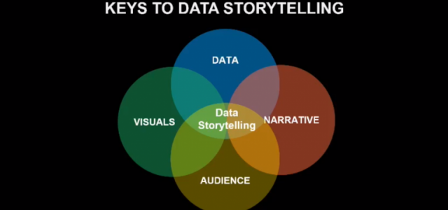

```{r setup, include=FALSE}
options(htmltools.dir.version = FALSE)
knitr::opts_chunk$set(echo = TRUE,   
                      message = FALSE,
                      warning = FALSE,
                      fig.height = 4,
                      fig.width = 8,
                      fig.align = "center")
library(tidyverse)
```

#Plan for today

- Data wrangling refresher

- `ggplot2` in `tidyverse`: Basic functions for data visualization 

- Grammar of graphics

- Data visualization best practices 

### It is not a programming unit! We concentrate on **DATA**!!!
---

# Visualization in the current world

A picture is worth a thousand words

Gapminder [case study](https://www.youtube.com/watch?v=hVimVzgtD6w) 

https://www.gapminder.org/tools/#$chart-type=bubbles

but

https://bing.com/covid

Data visualization competitions:

- Makeover Monday: https://www.makeovermonday.co.uk/

- Kantar Information is Beautiful Awards: https://www.informationisbeautifulawards.com/
---
# Data visualizatio for story telling


---


---
# `Tidyverse` and `ggplot2`


`ggplot2` [cheatsheet](https://github.com/rstudio/cheatsheets/blob/master/data-visualization-2.1.pdf)

Good resource: `ggplot2` [book](https://ggplot2-book.org/) 

---

Reminder:

- Rmarkdown [cheatsheet](https://github.com/rstudio/cheatsheets/blob/master/rmarkdown-2.0.pdf)

- Data wrangling [cheatsheet](https://github.com/rstudio/cheatsheets/blob/master/rmarkdown-2.0.pdf)

- Data import [cheatsheet](https://github.com/rstudio/cheatsheets/blob/master/data-import.pdf)

- Data transformation [cheatsheet](https://github.com/rstudio/cheatsheets/blob/master/data-transformation.pdf)

---
# `ggplot2` in `tidyverse`: Basic functions for data visualization 

Typical workflow:

- use `ggplot()`

- supply a dataset (piping `%>%` is great~)

- supply aesthetic mapping with `aes()`

- add layers, such as 

- - `geom_point()` or geom_histogram()) - **MUST**

- - scales (like `scale_colour_brewer()`) - **optional** 

- - faceting specifications (like `facet_wrap()`) and coordinate systems (like `coord_flip()`) **optional**

---
#Example

```{r}
mpg%>% ggplot( #ggplot() function
  aes(displ, hwy, colour = class)) + #aesthetics
  geom_point() #geometry
```

same as

```{r}
ggplot(mpg, #ggplot() function
  aes(displ, hwy, colour = class)) + #aesthetics
  geom_point() #geometry
```

Review the Help for `ggplot2` to identify major building blocks
https://ggplot2.tidyverse.org/
---
# Key components of data viz with `ggplot2`

Every ggplot2 plot has **three** key components:

- *data*

- A set of *aesthetic mappings* between variables in the data and visual properties, and

- At least one layer which describes how to render each observation. Layers are usually created with a `geom` function.


---
# Example

```{r}
avocado<-read_csv("https://raw.githubusercontent.com/maria-pro/bco7000/main/sessions/session3/avocado.csv")

#get clean names if not done before
avocado<-avocado%>%janitor::clean_names()

ggplot(avocado, aes(x = total_bags, y = total_volume)) + 
  geom_point()
```
---
# Example

- Data: `avocado`

- Aesthetic mapping: total_bags mapped to x position, total_volume to y position.

- Layer: points.

!!! The structure of this function call: 

- data and aesthetic mappings are supplied in `ggplot()`

- layers are added on with `+`.
---

# Compare:

```{r}
ggplot(avocado, aes(x = total_bags, y = total_volume)) + 
  geom_point()
```
---
# Compare:
```{r}
ggplot(avocado, aes(total_bags, total_volume)) + 
  geom_point()
```
---
# Compare:
```{r}
avocado %>% ggplot(aes(total_bags, total_volume)) + 
  geom_point()
```
---
#Most popular geometries

Depends on the **TYPE** of variables you use in your graph:

**ONE* variable - see frequency

- `geom_histogram()` (*continuous* var)

- `geom_bar()` (*discrete* var)

**TWO** var are *continuous* (what are continuous variables?):

- `geom_point()`

- `geom_line()`

- `geom_area()`

**TWO** var are *continuous* + *discrete*:

- `geom_col()`

- `geom_count()`

**TASK**: use the avocado dataset to create one for EACH type of viz
---
# Exercise

Let's use one of the in-built datasets `mpg` to complete the following tasks

```{r}
data(mpg)
head(mpg)
```
1. Review the dataset and use `Help` to locate data dictionary
---
# Exercise

Use the example and draw a data viz (`geom_point`) to display relationship between `cty` and `hwy`

How would you describe this relationship ? 


What does `ggplot(mpg, aes(model, manufacturer)) + geom_point()` show? Is it useful? How could you modify the data to make it more informative?

Describe the data, aesthetic mappings and layers used for each of the following plots. 

```{r eval=FALSE}
ggplot(mpg, aes(cty, hwy)) + geom_point()
ggplot(diamonds, aes(carat, price)) + geom_point()
ggplot(economics, aes(date, unemploy)) + geom_line()
ggplot(mpg, aes(cty)) + geom_histogram()
```
---
# Colour, size, shape and other aesthetic attributes


---
# Scales and coordinates

**Scales** map data values to the visual values of an aesthetic

Most popular:

- `scale_x_continuous()`

- `scale_x discrete`

**Coordinates** work with your coordinate system:

- `coord_flip()` flips your coordinates - EXTREMELY USEFUL!

**Task*: look at your data viz and change them to use scales and coordinates function

---
# Faceting

**Facets** divide a plot into subplots based on the values in settings:

To facet by **ONE** variable, use `facet_wrap()`:

- specify the variable to be used: shoul be **discrete**

```{r}
class(avocado$year)

avocado %>% ggplot(aes(total_bags, total_volume)) + 
  geom_point()+
  facet_wrap(~year)
```

Review Help for `facet_wrap()` and generate at least 2 viz using different options

Review Help for `facet_grid()` and generate at least 2 viz using different options
---
# Legend and themes

Colour theory: http://www.handprint.com/HP/WCL/color7.html

**Positioning**: A number of settings that affect the overall display of the legends 

`legend.position=` “right”, “left”, “top”, “bottom”, or “none” (no legend).

`legend.direction`: layout of items in legends (“horizontal” or “vertical”).
---
# Legend and themes

`ggplot2` comes with a number of built in themes

`theme_grey()`: the signature ggplot2 theme with a light grey background and white gridlines.

`theme_bw()`: a variation on theme_grey() that uses a white background and thin grey grid lines.

`theme_linedraw()`: A theme with only black lines of various widths on white backgrounds, reminiscent of a line drawing.

`theme_light()`: similar to theme_linedraw() but with light grey lines and axes, to direct more attention towards the data.

`theme_dark()`: the dark cousin of theme_light(), with similar line sizes but a dark background. Useful to make thin coloured lines pop out.

`theme_minimal()`: A minimalistic theme with no background annotations.

`theme_classic()`: A classic-looking theme, with x and y axis lines and no gridlines.
---
#Take away points```{r}

Let's refresh:

?

