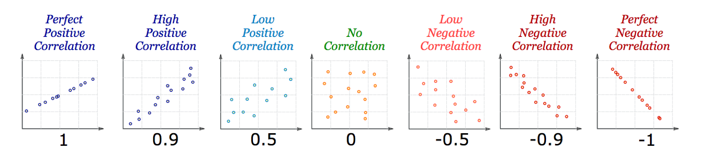

```{r setup, include=FALSE}
options(htmltools.dir.version = FALSE)
knitr::opts_chunk$set(echo = TRUE,   
                      message = FALSE,
                      warning = FALSE,
                      fig.height = 4,
                      fig.width = 8,
                      fig.align = "center")
```
#Plan for today

- Revising math 

- Basic concepts of modeling

- Basic models

- Revision of linear regression

- Modeling in R

---
# Revising math 

---
# What is a model

How do you understand the term `model`?

Think about examples of a model from  your daily life

---
# Basic concepts of modeling

 

---
# Basic concepts of modeling

 

---
# Basic concepts of modeling

Workflow that involves all of the steps where the data are analyzed in a significant way

- includes the model but 

might also include other estimation steps: 

- data preparation steps (e.g. imputation, encoding, transformations, etc) 

- selection of which terms go into the model and so on. 

---
# Basic models

- regression models

- classification models


---
# Correlation

*Correlation* is a statistic that measures the degree to which two variables move in relation to each other.

Correlation measures association, but does not tell you if x causes y or vice versa, or if the association is caused by some third (perhaps unseen) factor.

Correlation is Positive when the values increase together, and

Correlation is Negative when one value decreases as the other increases

---
# Correlation

Correlation can have a value:

1 is a perfect positive correlation

0 is no correlation (the values don't seem linked at all)

-1 is a perfect negative correlation


 

---
# Correlation

“corrr” package

Key R function: `correlate()`, which is a wrapper around the cor() R base function but with the following advantages:

Handles missing values by default with the optionuse = "pairwise.complete.obs"

Diagonal values is set to NA, so that it can be easily removed
Returns a data frame, which can be easily manipulated using the tidyverse package.

---
#`corrr` package

Additional arguments for the function correlate(), include:

`method`: a character string indicating which correlation coefficient (or covariance) is to be computed. One of “pearson” (default),

“kendall”, or “spearman”: can be abbreviated.

diagonal: Value (typically numeric or NA) to set the diagonal to.
---

#`corrr` package

Internal changes (cor_df out):

shave() the upper or lower triangle (set to NA).

rearrange() the columns and rows based on correlation strengths.


Reshape structure (tbl or cor_df out):

focus() on select columns and rows.

stretch() into a long format.


Output/visualisations (console/plot out):

fashion() the correlations for pretty printing.

rplot() the correlations with shapes in place of the values.

network_plot() the correlations in a network.

---
# Correlation Is Not Causation

One thing might cause the other

The other might cause the first to happen

They may be linked by a different thing

Or it could be random chance!

https://www.khanacademy.org/math/probability/scatterplots-a1/creating-interpreting-scatterplots/v/correlation-and-causality

---
# Linear regression

is one of the simplest and most common supervised machine learning algorithms that data scientists use for predictive modeling.

Aim: to model a continuous variable Y as a mathematical function of one or more X variable(s), so that we can use this regression model to predict the Y when only the X is known:

Y = β1 + β2X1 + ϵ

Height = b1 +b2 age + b3 nationality + b4 parents + b5 height of neighbors

where, β1 is the intercept and β2 is the slope. 

Collectively, they are called regression coefficients. ϵ is the error term, the part of Y the regression model is unable to explain.

---
# Linear regression

Linear regression assumes that there exists a linear relationship between the response variable and the explanatory variables. 

This means that you can fit a line between the two (or more variables). 

 
---
# Example

Height=a+Age∗b

 

“a” and “b” are called the intercept and the slope respectively. 

“a” or the intercept, is the value from where you start measuring. 
---
# Example

Height=a+Age∗b


Newborn babies with zero months are not zero centimeters necessarily; this is the function of the intercept. The slope measures the change of height with respect to the age in months. In general, for every month older the child is, his or her height will increase with “b”.

---
# Linear regression in R

 lm function: 
 
lm([target variable] ~ [predictor variables], data = [data source])

The data can be downloaded from VU Collaborate. 

Download the data to an object called ageandheight and then create
summary(lmHeight) you can see detailed information on the model’s performance and coefficients.

---
