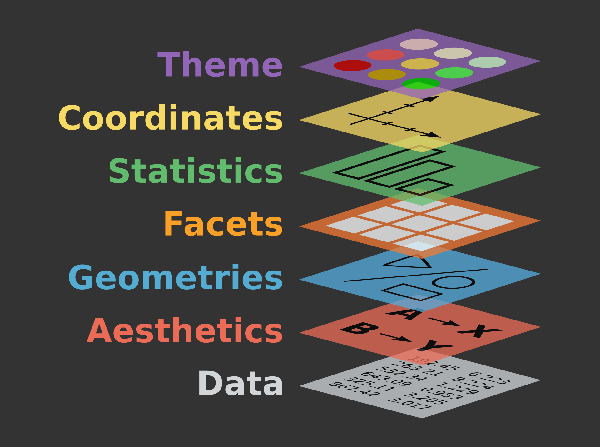

```{r setup, include=FALSE}
options(htmltools.dir.version = FALSE)
knitr::opts_chunk$set(echo = TRUE,   
                      message = FALSE,
                      warning = FALSE,
                      fig.height = 4,
                      fig.width = 8,
                      fig.align = "center")
```
#Plan for today

- data visualization with grammar of graphics

- `geom_` layers

- coordinates

- themes

- legend

- animations and `gganimate`

**Dataset**: hotel bookings https://github.com/rfordatascience/tidytuesday/blob/master/data/2020/2020-02-11/readme.md 
---
# Refresh:


---

# Working with the dataset:

**Task**: how can we load the dataset?

What steps should we do to explore the dataset?

What variables/observations does it have?

Is it tidy?

What questions can we ask with this data?

What transformation should be done to address questions?

---
# Let's revise the grammar of graphics

 
---
#Let's put it all together for our dataset

[hotel bookings](https://github.com/rfordatascience/tidytuesday/blob/master/data/2020/2020-02-11/readme.md)

Use `tidyverse` functions to explore the dataset

- skimr package
- distinct()
- count()
- arrange()
- group_by and summarise()

---
# Basic concepts of modeling

 


---
# Basic concepts of modeling

 


---
# Animation with `gganimate`

- If a picture is worth a thousand words, than animation is....

 

## Why animation

- engage readers and viewers in ways other visualization types may not be able to

- help people see transitions from one state to the next 

- enable them to more easily track changes as parts of your visualizations move from one point to another.
---
# When to use animation:

- Illustrating progression

- Seeing and understanding changes

- Exploration and analysis

- Communication for impact

https://www.tableau.com/about/blog/2020/3/benefits-animating-your-data-visualisations

---

# `gganimate()`

 
- extends the grammar of graphics of `ggplot2` to include animation

It adds new classes to work to work with animation:

- `transition_*()` defines how the data should be spread out and how it relates to itself across time.

- `view_*()` defines how the positional scales should change along the animation.

- `shadow_*()` defines how data from other points in time should be presented in the given point in time.

- `enter_*()/exit_*()` defines how new data should appear and how old data should disappear during the course of the animation.

- `ease_aes()` defines how different aesthetics should be eased during transitions.
---

#Example

```{r eval=FALSE}
#install.packages('gganimate')
library(gganimate)

mtcars %>% ggplot(aes(factor(cyl), mpg)) + 
  geom_boxplot() + 
  
  # Here comes the gganimate code
  transition_states(
    gear,
    transition_length = 2,
    state_length = 1
  ) +
  enter_fade() + 
  exit_shrink() +
  ease_aes('sine-in-out')
```
---
# Gapminder example

```{r eval=FALSE}
#install.packages("gapminder")

library(gapminder)

ggplot(gapminder, aes(gdpPercap, lifeExp, size = pop, colour = country)) +
  geom_point(alpha = 0.7, show.legend = FALSE) +
  scale_colour_manual(values = country_colors) +
  scale_size(range = c(2, 12)) +
  scale_x_log10() +
  facet_wrap(~continent) +
  # Here comes the gganimate specific bits
  labs(title = 'Year: {frame_time}', x = 'GDP per capita', y = 'life expectancy') +
  transition_time(year) +
  ease_aes('linear')

```
