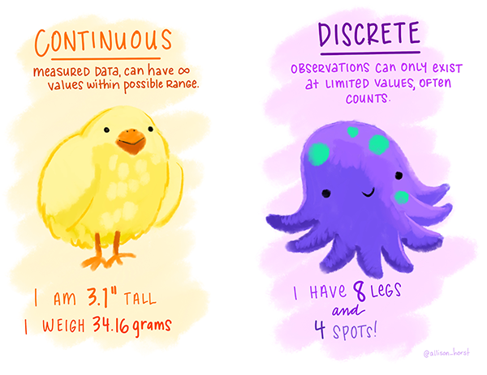
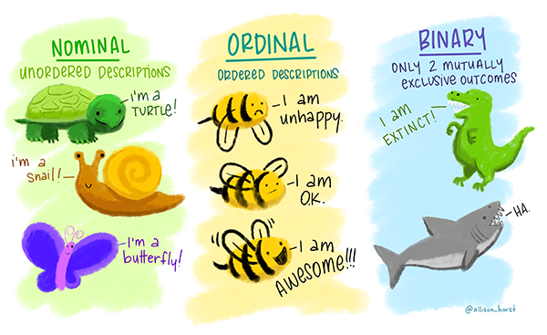
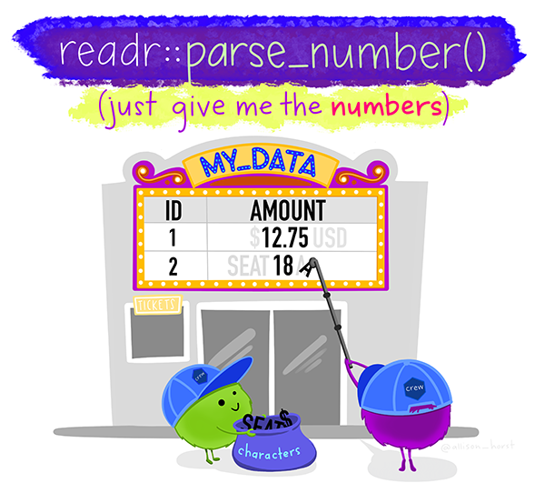
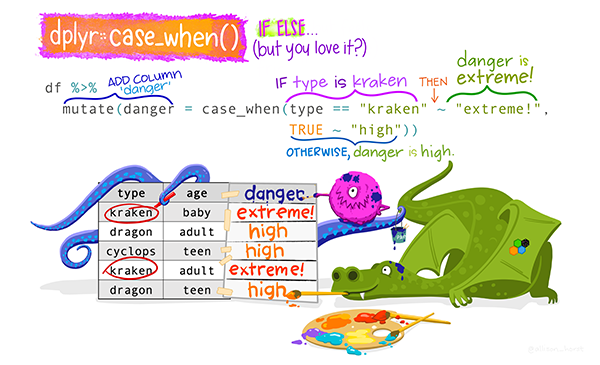

```{r setup, include=FALSE}
options(htmltools.dir.version = FALSE)
knitr::opts_chunk$set(echo = TRUE,   
                      message = FALSE,
                      warning = FALSE,
                      fig.height = 4,
                      fig.width = 8,
                      fig.align = "center")

```
# Plan for today

- Types of variables

- Working with factors

- Working with text (=strings)

- Working with dates
---
#Types of data

- Discrete variables

- Continuous variables

- Categorical/Ordinal variables = factors

- Textual information: what is specific about it?

- Dates: what is specific about working with dates?

Let's look at the [hotel bookings data](https://github.com/rfordatascience/tidytuesday/tree/master/data/2020/2020-02-11) and see what variable types we have and if they are recorded properly

```{r}
#install.packages("lubridate")
library(tidyverse)
library (skimr)
library(lubridate)

hotels <- readr::read_csv('https://raw.githubusercontent.com/rfordatascience/tidytuesday/master/data/2020/2020-02-11/hotels.csv')

```

```{r eval=FALSE}
summary(hotels)

skim(hotels)
```
---
#Discrete variables and Continous variables


---
#Categorical/Ordinal variables = factors in R


---
#Let's convert between different types of variables

`as_factor()`: converts to a factor

`as_string()`: converts symbols to strings

`as_integer()`: converts to an integer

`as_logical()`: converts to logical TRUE or FALSE


Let's do some conversion in the dataset.

---
#case_when



---
Let's have a look at this example and try to understand what is it doing and how we convert and transform the data here:


```{r}
hotel_stays <- hotels %>%
  filter(is_canceled == 0) %>%
  mutate(
    children = case_when(
      children + babies > 0 ~ "children",
      TRUE ~ "none"
    ),
    required_car_parking_spaces = case_when(
      required_car_parking_spaces > 0 ~ "parking",
      TRUE ~ "none"
    )
  ) %>%
  select(-is_canceled, -reservation_status, -babies)
```
---


```{r}
hotel_stays %>%
  mutate(arrival_date_month = factor(arrival_date_month,
    levels = month.name
  )) %>%
  count(hotel, arrival_date_month, children) %>%
  group_by(hotel, children) %>%
  mutate(proportion = n / sum(n)) %>%
  ggplot(aes(arrival_date_month, proportion, fill = children)) +
  geom_col(position = "dodge") +
  scale_y_continuous(labels = scales::percent_format()) +
  facet_wrap(~hotel, nrow = 2) +
  labs(
    x = NULL,
    y = "Proportion of hotel stays",
    fill = NULL
  )

```
---
#NEW Dataset

We will be working with a pizza dataset from Tidy Tuesday project
[Link](https://github.com/rfordatascience/tidytuesday/tree/master/data/2019/2019-10-01)

```{r}
pizza<-read_csv("https://raw.githubusercontent.com/rfordatascience/tidytuesday/master/data/2019/2019-10-01/pizza_jared.csv")

pizza %>% head
```
---
#Discrete vs continous variables

A **discrete** variable: a variable whose value is obtained by counting. 

Examples: 1, 2, 4

A **continuous** variable: a variable whose value is obtained by measuring. 

Examples: 1.4, 2.78, 4.54

We can use `skimr` package to easily see the types of variables. 

`summary()` is another base R function that can do this in a less visual way.

**Task**: use Help to read about `skimr` package and `summary()` function uses.

Use both functions to see variables in the `pizza` dataset

---
# Working with variables in R

```{r}

class(pizza$polla_qid)
class(pizza$percent)
```
---
# Categorical/Ordinal variables 

a variable that can take on one of a limited, and usually fixed, number of possible values

Called `Factors` in R

```{r}
class(pizza$answer)
```

not factor yet!

To make it factor let's try 

```{r}
pizza$answer<-as_factor(pizza$answer)

class(pizza$answer)
```
---

# Factors

R uses `factors` to handle categorical variables

Factors are also helpful for reordering character vectors to improve display. 


---
#Task

Explore the dataset and think about where else we need to use factors. 
Make the correction necessary 

Use `skim()` to show the variable types

---

# Major functions to work with factors

fct_reorder(): Reordering a factor by another variable.

fct_infreq(): Reordering a factor by the frequency of values.

fct_relevel(): Changing the order of a factor by hand.

fct_lump(): Collapsing the least/most frequent values of a factor into “other”.


**Task**: review the dataset and identify where these functions can be applied.
---
# Dates

Date-time data can be frustrating to work with in R. 

R commands for date-times are generally unintuitive and change depending on the type of date-time object being used. 

Moreover, the methods we use with date-times must be robust to time zones, leap days, daylight savings times, and other time related quirks, and R lacks these capabilities in some situations. 

Lubridate makes it easier to do the things R does with date-times and possible to do the things R does not.

If you are new to lubridate, the best place to start is the date and times chapter in R for data science.

---
# Working with dates in R

Cheatsheet https://rawgit.com/rstudio/cheatsheets/master/lubridate.pdf

**Task**: review the dataset and see how main dates functions can be applied


---
# Major functions to work with dates:

```{r}
ymd("2017-01-31")
mdy("January 31st, 2017")
dmy("31-Jan-2017")

ymd_hms("2017-01-31 20:11:59")
mdy_hm("01/31/2017 08:01")

```
---
#Let's put it in practice

Time format: POSIX

`Unix` time (also known as Epoch time, POSIX time, seconds since the Epoch, or UNIX Epoch time) is a system for describing a point in time.

```{r}
pizza$time %>%
  head()

#to convert to readable time
time<-pizza$time %>%
  as.POSIXct(origin = "1970-01-01") %>%
  head()

#to isolate date

time%>%
  as.Date()%>%
  head()
```
---
#Let's review `answer` variable

```{r}
#let's get the list of distinct answers
pizza%>%
  distinct(answer)

answer_orders <- c("Never Again", "Poor", "Average", "Good", "Excellent")

#let's clean the names in our dataset
pizza <- pizza %>%
  mutate(time = as.POSIXct(time, origin = "1970-01-01"),
         date = as.Date(time),
         answer = fct_relevel(answer, answer_orders)) 

#let's see where the best place is

by_place_answer<-pizza%>%
  group_by(place, answer) %>%
  summarize(votes = sum(votes))%>%
  mutate(total = sum(votes),
         percent = votes / total,
         answer_integer = as.integer(answer),
         average = sum(answer_integer * percent)) %>%
  ungroup()

by_place <- by_place_answer %>%
  distinct(place, total, average)
```
---
#Let's put it on the dataviz

```{r}
by_place_answer %>%
  filter(as.integer(fct_reorder(place, total, .desc = TRUE)) <= 16,
         answer != "Fair") %>%
  mutate(place = glue::glue("{ place } ({ total })"),
         place = fct_reorder(place, average)) %>%
  ggplot(aes(answer, percent)) +
  geom_col() +
  facet_wrap(~ place) +
  scale_y_continuous(labels = scales::percent) +
  theme(axis.text.x = element_text(angle = 90, hjust = 1)) +
  labs(x = "",
       y = "% of respondents",
       title = "What is the most popular pizza place in Open Stats meetup?",
       subtitle = "Only the 16 pizza places with the most respondents. # respondents shown in parentheses.")
```

---
#Text

- Characters vs strings

Strings are not glamorous, high-profile components of R, but they do play a big role in many data cleaning and preparation tasks. 

The `stringr` package provide a cohesive set of functions designed to make working with strings as easy as possible. 
---
# Working with strings

Cheatsheet https://github.com/rstudio/cheatsheets/blob/master/strings.pdf

**Task**: review the dataset and see how main string functions can be applied


