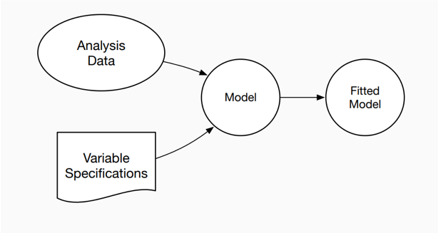
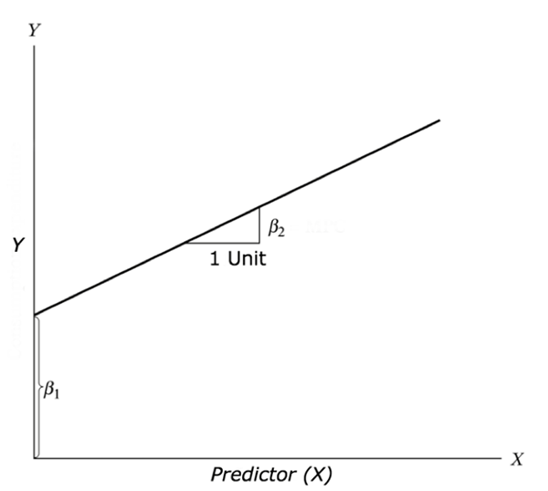
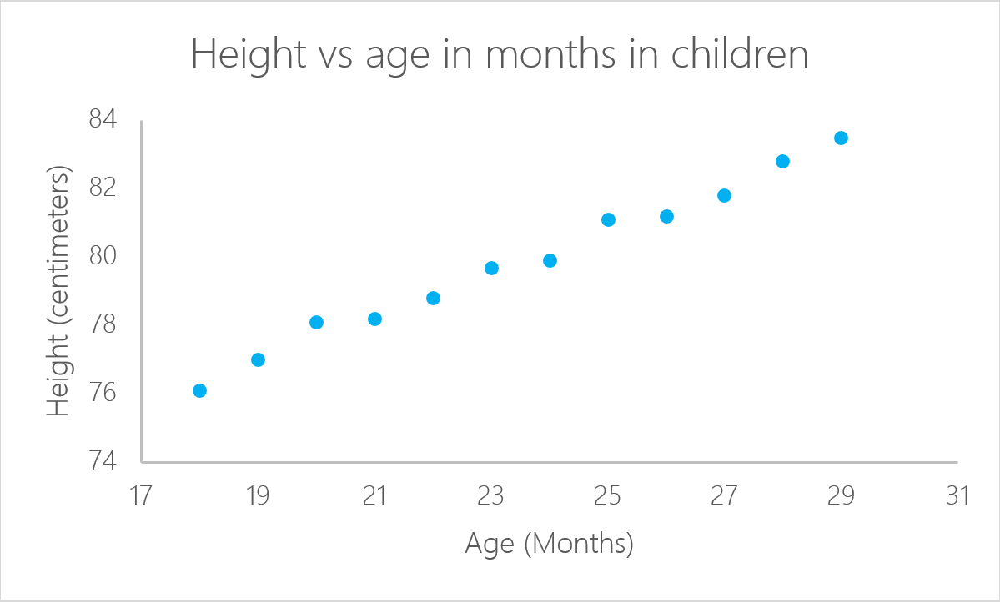
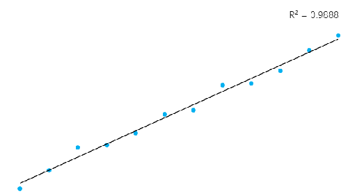

```{r setup, include=FALSE}
options(htmltools.dir.version = FALSE)
knitr::opts_chunk$set(echo = TRUE,   
                      message = FALSE,
                      warning = FALSE,
                      fig.height = 4,
                      fig.width = 8,
                      fig.align = "center")

#install.packages("glue")
library(tidyverse)
library(skimr)
library(lubridate)
library(scales)
library(glue)
theme_set(theme_light())
```
# Modeling- Covariation

= the tendency for the values of two or more variables to vary together in a related way. 

The best way to spot covariation is to visualise the relationship between two or more variables.

```{r}
ggplot(data = diamonds, mapping = aes(x = price)) + 
  geom_freqpoly(mapping = aes(colour = cut), binwidth = 500)
```
---
#Covariation

To visualise the covariation between categorical variables, you’ll need to count the number of observations for each combination.

```{r}
ggplot(data = diamonds) +
  geom_count(mapping = aes(x = cut, y = color))
```

---

```{r}
ggplot(data = diamonds) + 
  geom_point(mapping = aes(x = carat, y = price), alpha = 1 / 100)
```
---

# Models

If a systematic relationship exists between two variables it will appear as a pattern in the data:

Could this pattern be due to coincidence (i.e. random chance)?

How can you describe the relationship implied by the pattern?

How strong is the relationship implied by the pattern?

What other variables might affect the relationship?

Does the relationship change if you look at individual subgroups of the data?

```{r}
ggplot(data = diamonds) + 
  geom_point(mapping = aes(x = carat, y = price), alpha = 1 / 100)
```
---
# Models

All models are wrong, but some are useful.

 

---
# Basic models

- regression models

- classification models
---
# Linear regression

is one of the simplest and most common supervised machine learning algorithms that data scientists use for predictive modeling.

Aim: to model a continuous variable Y as a mathematical function of one or more X variable(s), so that we can use this regression model to predict the Y when only the X is known:

Y = β1 + β2X1 + ϵ

Height = b1 +b2 age + b3 nationality + b4 parents + b5 height of neighbors

where, β1 is the intercept and β2 is the slope. 

Collectively, they are called regression coefficients. ϵ is the error term, the part of Y the regression model is unable to explain.

---
# Linear regression

Linear regression assumes that there exists a linear relationship between the response variable and the explanatory variables. 

This means that you can fit a line between the two (or more variables). 

 
---
# Linear regression

 
you can calculate the height of a child if you know her age:

Height=a+Age∗b
In this case, “a” and “b” are called the intercept and the slope respectively. With the same example, “a” or the intercept, is the value from where you start measuring. Newborn babies with zero months are not zero centimeters necessarily; this is the function of the intercept. The slope measures the change of height with respect to the age in months. In general, for every month older the child is, his or her height will increase with “b”.

---
# Linear regression in R

A linear regression can be calculated in R with the command `lm`

```{r}
library(readxl)
ageandheight <- read_excel("ageandheight.xls", sheet = "Hoja2") #Upload the data
lmHeight = lm(height~age, data = ageandheight) #Create the linear regression
summary(lmHeight) #Review the results
```
---
# Coefficients

values of the intercept (“a” value) and the slope (“b” value) for the age. 

These “a” and “b” values plot a line between all the points of the data

e.g if there is a child that is 20.5 months old, a is 64.92 and b is 0.635, the model predicts (on average) that its height in centimeters is around 64.92 + (0.635 * 20.5) = 77.93 cm.
---
# Multiple linear regression

a regression takes into account two or more predictors to create the linear regression

Height = a + Age × b1 + (Number of Siblings} × b2

```{r}
lmHeight2 = lm(height~age + no_siblings, data = ageandheight) #Create a linear regression with two variables
summary(lmHeight2) #Review the results
```

---
# p-value

a p-value indicates whether or not you can reject or accept a hypothesis. The hypothesis, in this case, is that the predictor is not meaningful for your model.

The p-value for age is 4.34*e-10 or 0.000000000434. A very small value means that age is probably an excellent addition to your model.

The p-value for the number of siblings is 0.85. In other words, there’s 85% chance that this predictor is not meaningful for the regression.

A standard way to test if the predictors are not meaningful is looking if the p-values smaller than 0.05.

---
# Residuals

the differences between the real values and the predicted values. 

The straight line in the image above represents the predicted values. The red vertical line from the straight line to the observed data value is the residual.

Hint: keep the sum of the residuals is approximately zero or as low as possible
 
 
---
# How to test if your linear model has a good fit?


the coefficient of determination or R². This measure is defined by the proportion of the total variability explained by the regression model.

R2=Explained Variation of the model/ Total variation of the model

In general, for models that fit the data well, R² is near 1. 

Models that poorly fit the data have R² near 0. 

In the examples below, the first one has an R² of 0.02; this means that the model explains only 2% of the data variability. 

The second one has an R² of 0.99, and the model can explain 99% of the total variability.**

---
 
---
# Don’t forget to look at the residuals!


